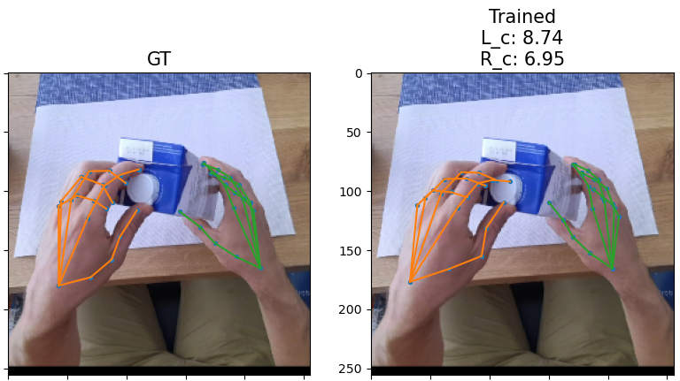
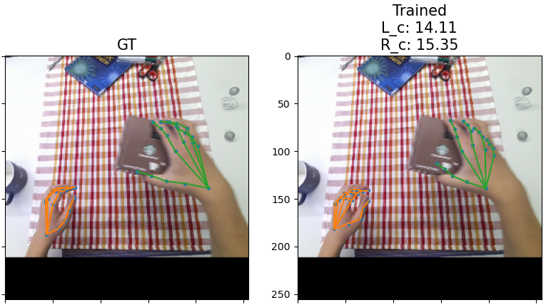

Repository for Master Thesis:
# Reconstructing Human Hands from Egocentric RGB Data @Unipd
[Thesis Page](http://hdl.handle.net/20.500.12608/36020)
### Abstract:
Reconstructing 3D poses from a single RGB image is a challenging
task. Such computer vision problem hides an inherent ambiguity in
the determination of the depth coordinate of the keypoints. In the
following work I will start from exploring state-of-the-art approaches
used to solve it focusing specifically on Human Hands Pose Estima-
tion I will consider the most natural settings, including self-interaction
and interaction with objects. Expressing the groundtruth hand label
coordinates in the reference frame centered in a standard point (e.g.
camera center) or in one of the hand joints, plays an important role
to the success of the training process. After evaluating the benefits of
choosing a specific one, I propose a multi-stage approach separately
regressing root-relative pose and root coordinates in the camera ref-
erence frame. Such model is then trained and tested on the novel
dataset: [H2O dataset (2 Hands and Objects)](https://taeinkwon.com/projects/h2o/).

### Example outputs:

This repository contains modified code taken from:
["Interacting Two-Hand 3D Pose and Shape Reconstruction from Single Color Image" (ICCV 2021)](https://openaccess.thecvf.com/content/ICCV2021/papers/Zhang_Interacting_Two-Hand_3D_Pose_and_Shape_Reconstruction_From_Single_Color_ICCV_2021_paper.pdf)
["Camera Distance-aware Top-down Approach for 3D Multi-person Pose Estimation from a Single RGB Image" (ICCV 2019)](https://arxiv.org/abs/1907.11346)